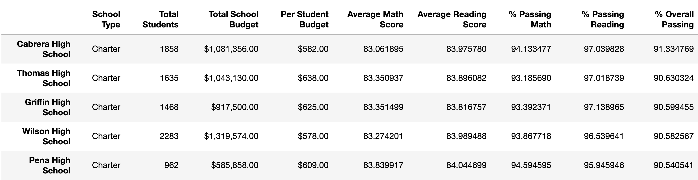
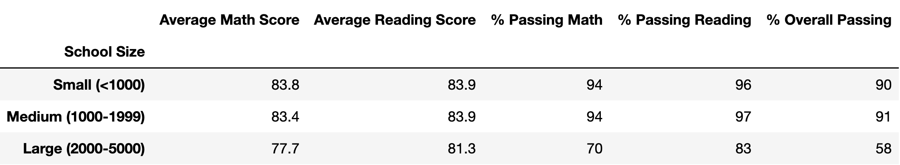

# PyCitySchools with Pandas
Repeat the school district analysis with omitted Thomas High School 9th grade scores.

## Overview

The school board suspects that the math and reading scores for Thomas High School 9th graders may have been altered. To uphold state-testing standards, remove the Thomas High School 9th grade scores and rerun the school district analysis. Compare this new school district analysis with the previous one and determine what changes, if any, occurred.

## Results

The results are a comparison between the school district analysis before and after removing the Thomas High School 9th grade math and reading scores.

Sample of Thomas High School 9th grader math and reading scores after being replaced by `NaN`s.

---

- The district summary was only minorly affected for average math score, which reduced by 0.1 points after removal (actually 0.055 points looking at unrounded data not shown here). This difference is negligible.

District Summary before removal

 

District Summary after removal

---
- The school summary was unaffected except for Thomas High School where the passing math percentage went down by 0.09%, the passing reading percentage went down by 0.29%, and the overall passing percentage went down by 0.32%. These differences are negligible.

School Summary before removal

 

School Summary after removal

---

- The ranking of Thomas High School as the second highest performing school remained unchanged. The rankings of the top and bottom 5 schools by overall passing percentage are shown.

School Summary Top 5 before removal

 

School Summary Top 5 after removal

 

School Summary Bottom 5 before removal

 

School Summary Bottom 5 after removal

---

- The average math and reading scores by grade level by school are identical except where the Thomas High School 9th scores are replaced by `nan`.

| Average Math Scores | |
| :--- | :--- |
|  |  |
| Before removal | After removal |

| Average Reading Scores | |
| :--- | :--- |
|  |  |
| Before removal | After removal |

---

- Scores by school spending remained unchanged. Thomas High School is in the $631-$645 bracket.

School Spending Summary before removal

 

School Spending Summary after removal

---

- Scores by school size remained unchanged. Thomas High School is a medium sized school.

School Size Summary before removal

 

School Size Summary after removal

---

- Scores by school type remained unchanged. Thomas High School is a charter school.

School Type Summary before removal

 

School Type Summary after removal

## Summary

Upon removing (replacing with `NaN`s/`nan`s) the Thomas High School 9th grade math and reading scores, the district summary and school summary showed negligible differences. There was no difference in school ranking (#2), the scores by school spending, scores by school size, or scores by school type.

Moreover, the Thomas High school 9th grade average math and reading scores are in line with those of the Thomas High School 10th, 11th, and 12th graders.

The conclusion is that there is no evidence of academic dishonesty at Thomas High School through 9th grade math and reading score tampering.

